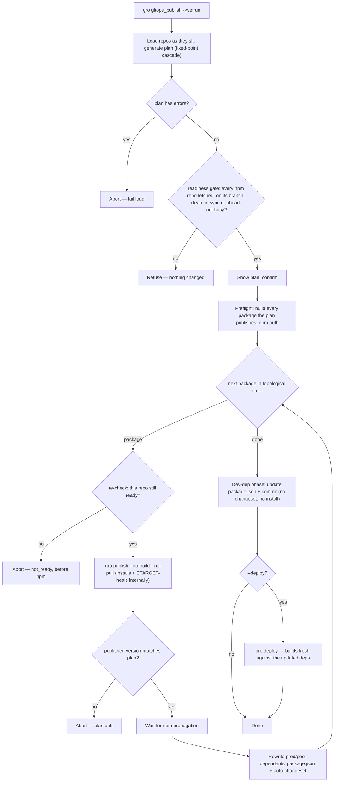

# Publishing Guide

This guide covers multi-repo publishing workflows, changeset semantics, and the
algorithms that power fuz_repos publishing.

## Table of Contents

- [Quick Start](#quick-start)
- [Changeset Semantics](#changeset-semantics)
- [Plan vs Dry Run](#plan-vs-dry-run)
- [Readiness](#readiness)
- [Publishing Flow](#publishing-flow)
- [Publishing Algorithms](#publishing-algorithms)
- [Private Packages](#private-packages)
- [Workflows](#workflows)
- [Examples](#examples)

## Quick Start

```bash
# 1. Fetch, fast-forward what's behind, push what's ahead (repos off their branch or dirty are yours to move)
repos sync

# 2. Validate configuration (writes nothing in git)
gro gitops_validate

# 3. Review what will be published
gro gitops_plan

# 4. Publish
gro gitops_publish --wetrun
```

## Changeset Semantics

Packages can publish in four distinct scenarios:

### 1. Explicit Changesets (Normal Publishing)

- Package has `.changeset/*.md` files
- Dependency updates don't require higher bump
- Behavior: Published with version bump from changesets
- Reported as: "Version Changes (from changesets)"

### 2. Explicit Changesets with Bump Escalation

- Package has `.changeset/*.md` files specifying bump type
- BUT dependency updates require a HIGHER bump
- Behavior: Published with escalated bump (e.g., `patch` → `minor` for breaking
  dep)
- Reported as: "Version Changes (bump escalation required)"
- Example: You write `patch` changeset, but `gro` (breaking) forces `minor`

### 3. Auto-Generated Changesets

- Package has NO `.changeset/*.md` files
- BUT has production/peer dependency updates
- Behavior: Changeset auto-generated, package republished
- Reported as: "Version Changes (auto-generated for dependency updates)"
- Example: `gro` publishes → `fuz` depends on `gro` → auto-changeset for `fuz`
- Never an escalation: when a dependency turns breaking in a later pass (a
  dependent listed before its dependency in the config), the auto-generated
  change is raised to the bump that requires and stays in this group

### 4. No Changes to Publish

- Package has NO `.changeset/*.md` files
- Package has NO production/peer dependency updates
- Behavior: Skipped (not published)
- Reported as: "No changes", the plan's `no_changes` package list (not a
  warning)
- This is normal: Only packages with changes should publish

A package with changeset files that yield no bump for it — none parses, or
none that parses names it — takes no bump from them — it publishes only as an
auto-generated change if a dependency update requires one — and the plan warns,
naming the repo and why.

### Dependency Update Behavior

When a dependency is updated:

- **Production/peer deps**: Package must republish (triggers auto-changeset if
  needed)
- **Dev deps**: Package.json updated, NO republish (dev-only changes)

When a package appears in both production/peer and dev dependencies,
production/peer takes priority for dependency graph calculations.

## Plan vs Dry Run

### `gro gitops_plan`

- **Read-only prediction** - Generates a publishing plan showing what would be
  published
- Uses fixed-point iteration to resolve transitive cascades (max 10 iterations)
- Shows every publishing scenario: explicit changesets, bump escalation,
  auto-generated changesets, and no changes — each package in exactly one
- `--format json` carries `no_changes` (package names) apart from `info`
  (informational sentences: excluded non-npm repos, dev dependency cycles)
- Read-only - moves no ref and writes nothing in git
- Reads each repo's working tree **as-is** (whatever branch is checked out, even
  with uncommitted changes), and prints a readiness block naming each repo not
  at rest (see [Readiness](#readiness)), so a plan over a feature branch says
  so. Run `repos sync` beforehand so the plan reflects the canonical branches
  rather than your local checkout.

### `gro gitops_publish` (dry run, default)

- **Plan-driven preview** - The dry run reports the same plan as `gro
gitops_plan`, so it shows the full cascade: explicit changesets, bump
  escalations, and auto-generated changesets
- Skips the readiness gate and preflight checks (npm auth, builds), and prints
  the same readiness block as `gro gitops_plan`
- Read-only - reports what `--wetrun` would publish without touching git or npm
- The dry-run count matches `gro gitops_plan`; the difference between them is
  framing, not content (`plan` is the read-only report, the dry run is the
  publish command in preview mode)
- Add `--preview` to print the ordered side-effects (publishes, npm waits,
  dependency rewrites, dev-dep updates, deploys) the cascade would perform

## Readiness

A real publish reads every npm repo as it sits and commits and pushes there, so
before it prints the plan and asks to confirm, `gro gitops_publish --wetrun`
fetches them (`repos status <keys…> --fetch --json`, which moves
only remote-tracking refs) and refuses unless each is ready:

- on the branch its registry entry follows, clean (untracked files count), and
  with no rebase, merge, or other operation in progress
- that branch in sync with origin, as the fetch just saw it, or ahead of it —
  not behind or diverged — and the fetch didn't fail
- no other live Claude Code session working in its checkout, and busy
  detection able to vouch for every session
- nothing `repos status` leaves to a person (`needs_human`: origin drift, a
  branch with no upstream, …)

It gates every npm repo in the config, not just the ones the plan publishes or
rewrites, because the plan reads each one's changesets, version, and
dependency ranges: a repo off its branch or behind origin can hide a changeset
and leave the plan wrong. The refusal names each repo, what's wrong, and the
fix, and nothing has changed — the gate never moves a repo. `repos sync`
fast-forwards what's behind; the rest (switching branch, committing, stashing,
or discarding changes, finishing a rebase) is yours.

A branch **ahead** of origin is ready: origin's tip is an ancestor, so the
plan misses nothing, and `gro publish`'s push is still a fast-forward. The gate
logs each one before the prompt — `` `main` is 2 commits ahead of origin —
publishing pushes them with the release`` — or, for a repo the plan doesn't
publish, that those commits stay unpushed until `repos sync` or `repos push`.
A run leaves such branches itself: the dependency rewrites and auto-changesets
it commits in a repo it doesn't then publish, and every dev-dep bump (the
dev-dep phase runs after all publishes), stay local until `repos sync`,
`repos push`, or that repo's next release.

The gate runs before the prompt; a cascade's npm waits can stretch the time
after it to many minutes. Under `--no-pull`, gro wouldn't notice origin moving
until its push is rejected — after `changeset publish` has put the version on
npm, leaving a local release commit and tag on a diverged branch (gro ignores
its push's exit code, so the run carries on) — and its `commit -a` would sweep
a tracked edit made since into the release commit. So the executor
**re-checks each repo right before its `gro publish`** (a `repos status
--fetch` of that repo alone, the same predicate) and aborts before touching
npm unless it's still ready — in sync or ahead, since the executor's own
dependency-rewrite commit leaves a dependent ahead. The abort is a `not_ready`
failure, like `drift`: the dirty state stays, and re-running resumes.

Two windows are left: the seconds between that re-check and gro's push (see
[Troubleshooting](troubleshooting.md#a-release-commit-and-tag-left-local-the-push-was-rejected)),
and the executor's own dependency-rewrite commits, which aren't re-checked:
each commits only the `package.json` and changeset it staged (`git commit --
<files>`), but lands on whatever branch the repo is on then.

The diagnostics (`gitops_plan`, `gitops_analyze`, `gitops_validate`, and the
dry run) read the same facts from local refs, without fetching, and print a
readiness block as warnings on stderr, naming each npm repo not at rest — off
its branch (naming the head), dirty, an operation in progress, or its branch
behind, ahead, diverged, or otherwise off origin as of the last fetch. These
are the repos a real publish would refuse, except that a branch only ahead of
origin passes its gate. They still run: a plan over a feature branch is
useful, it just isn't the plan a real publish would run.

## Publishing Flow

A real publish (`gro gitops_publish --wetrun`) generates the plan once, then executes
it as a frozen, single-pass cascade. The plan is the single source of truth — the
executor re-derives nothing and fails loud rather than diverge from it.



Preflight takes the plan's version changes and builds exactly those packages —
explicit, escalated, and auto-generated alike — against the current, pre-cascade
dependency versions, then checks npm authentication and the registry. Any build
failure stops the run before anything touches npm. It reads no changesets and no
git: the plan already decided what publishes, and the readiness gate owns git
state.

Each `gro publish --no-build --no-pull` step is itself a pipeline: it checks out the
branch the registry entry follows (`--branch`), skips its own `git pull` (the
re-check just found the branch in sync with origin or ahead), syncs, installs (this
install self-heals npm's stale-cache ETARGET — clear the cache and retry once when a
just-published version isn't visible yet), runs `gro check` (typecheck + tests against
the freshly-installed dependency versions), bumps the version, installs again to refresh
the lockfile, and regenerates — it only skips the final `gro build`. So a dependency that
breaks a dependent is caught by that `gro check` and aborts the run. The executor itself
never runs a bare `npm install`: gro owns installing (and healing), so a dependent's deps
are installed when its own `gro publish` reaches it.

The executor runs each `gro publish` and `gro deploy` in the foreground: its output
shows live, and stdin is the terminal's, so npm can prompt for a 2FA one-time password
mid-cascade. When the task's own stdout carries a machine-readable stream — the
`--emit_json` events, or a `--format json` or `markdown` report not sent to `--outfile`
— the child's stdout goes to stderr instead, so it can't corrupt that stream. A failed
step's message carries the end of the child's stderr (its last lines, with known secret
shapes like npm tokens redacted), so the result, the events, and the report say why
without the terminal scrollback.

Dev-dep-only dependents never run `gro publish`, so the executor bumps + commits their
`package.json` without installing them; gro refreshes (and heals) their `node_modules`
the next time they build or deploy.

Deploys (`--deploy`) build fresh rather than reuse the preflight build, because a
deployed site bundles its dependencies and must reflect the versions just published.

## Publishing Algorithms

### Fixed-Point Iteration (Cascade Resolution)

The publishing plan generation uses fixed-point iteration to resolve transitive
breaking change cascades:

1. **Initial pass**: Identify all packages with explicit changesets
2. **Iteration loop** (max 10 iterations):
   - Calculate dependency updates based on predicted versions
   - For each package:
     - Check if dependencies require a bump (prod/peer deps only)
     - **Bump escalation**: If existing changesets specify lower bump than
       required, escalate
     - **Auto-changesets**: If no changesets but deps updated, generate
       auto-changeset; if one already planned needs a larger bump now, raise
       it (still an auto-changeset, not an escalation)
     - Track breaking changes to propagate to dependents
   - Loop until no new version changes discovered (fixed point reached)
3. **Final pass**: Calculate all dependency updates and cascades

The 10-iteration limit prevents infinite loops while handling complex dependency
graphs. Each iteration reaches at least one more level of dependents; a plan
that hits the limit still changing warns, naming the packages one more pass
would change.

This iteration happens during **plan generation**. The real publish
(`gro gitops_publish --wetrun`) then executes the frozen plan in a single linear
pass over the dependency order, re-deriving nothing — publishing a package
immediately creates its dependents' changesets, so one topological pass suffices.
If a publish produces a version the plan did not predict, publishing aborts
(fail-loud on drift) rather than silently diverging; re-running re-plans from the
current state.

### Cycle Detection Strategy

The system uses topological sort with dev dependency exclusion:

- **Production/peer cycles**: Block publishing (error, must be resolved)
  - These create impossible ordering: Package A depends on Package B which
    depends on Package A
  - Solution: Move one dependency to devDependencies or restructure
- **Dev cycles**: Allowed and normal (reported as info, not a warning)
  - Dev dependencies don't affect runtime, so cycles are safe
  - Topological sort excludes dev deps (`exclude_dev=true`) to break these
    cycles
- **Publishing order**: Computed via topological sort on prod/peer deps only
  - Ensures dependencies publish before dependents
  - Deterministic and reproducible
  - Dev dependencies updated in separate phase after all publishing completes
- **Dependency priority**: When a package appears in multiple dependency types,
  production/peer takes priority over dev

This strategy enables practical multi-repo patterns (e.g., shared test
utilities) while preventing runtime dependency issues.

## Private Packages

Packages with `"private": true` in package.json never publish:

- Excluded from the plan's version changes — no publish, npm-wait, bump
  escalation, or auto-changeset — so the executor skips them (they keep their
  slot in the topological order)
- A private package depending on a published one is updated as a leaf: its
  dependency ranges are rewritten and committed without a changeset (it won't
  republish)
- A private package carrying its own changeset is flagged in the plan's warnings,
  since that changeset can't be published
- Dependents can still publish normally
- Use for internal tools, test utilities, dev-only packages

## Workflows

### Safe Validation Workflow

Before publishing, always validate your configuration:

```bash
# 1. Fetch, fast-forward what's behind, push what's ahead, so the checks read the canonical branches
repos sync

# 2. Run comprehensive validation (writes nothing in git)
gro gitops_validate

# 3. Review analyze output
gro gitops_analyze

# 4. Review plan to see what will be published
gro gitops_plan

# 5. Test with dry run (default)
gro gitops_publish

# 6. If everything looks good, actually publish
gro gitops_publish --wetrun
```

### Output Formats

Save analysis or plans to files for review:

```bash
gro gitops_analyze --format json --outfile analysis.json
gro gitops_plan --format markdown --outfile plan.md
```

Without `--outfile`, a `--format json` or `markdown` report goes to stdout, and so
do `gitops_publish --emit_json`'s JSON-lines events and `gitops_run --format json`'s
results. In those modes everything meant for a person goes to stderr instead: the
task's log (the plan, the readiness block and gate, the executor's progress), gro's
own lines after the task, the stdout of the `gro publish` and `gro deploy` it runs,
and the confirmation prompt, which is always on stderr. With both `--emit_json` and
a `json` or `markdown` report on stdout, the report follows the events on stdout;
give the report an `--outfile` to keep the stream line-parseable. Gro prints two
lines before a task runs (`[gitops_plan] invoking gitops_plan` and `[gitops_plan] →
gitops_plan …`) that the task can't reach, so they still lead stdout; use
`--outfile` for a file holding the document alone, or skip them when piping
(`tail -n +3` at the default log level).

The JSON report masks secrets in its `events` as the `--emit_json` stream does, and
the markdown report masks them in its failures.

## Examples

### Publishing a single package with changesets

```bash
# Create a changeset for your package
cd packages/my-package
gro changeset
# Follow prompts to describe changes
git commit -m "add changeset"  # the readiness gate refuses uncommitted changes

# Generate plan to see what will be published
gro gitops_plan
# Output shows: my-package: 1.0.0 → 1.1.0 (minor)

# Publish
gro gitops_publish --wetrun
```

### Publishing multiple packages with cascading dependencies

```bash
# You have changesets in @my/core
# Dependents: @my/ui depends on @my/core

# Plan shows cascade
gro gitops_plan
# Output:
#   [1/2] @my/core: 1.0.0 → 2.0.0 (major) BREAKING
#   [2/2] @my/ui: 1.5.0 → 2.0.0 (major) [auto-changeset] BREAKING
#         triggered by: @my/core (BREAKING)

# Publish in dependency order
gro gitops_publish --wetrun
```

### Recovering from failures (natural resumption)

```bash
# Publishing failed midway through
gro gitops_publish --wetrun
# Error: Failed to publish @my/package-5

# Fix the issue, then re-run the same command
gro gitops_publish --wetrun
# Already-published packages have no changesets → skipped automatically
# Failed packages still have changesets → retried automatically
```

### Bump escalation

```bash
# You created a patch changeset for @my/app
# But @my/core (dependency) has a breaking change

# Plan shows escalation
gro gitops_plan
# Output:
#   [1/2] @my/core: 1.0.0 → 2.0.0 (major) BREAKING
#   [2/2] @my/app: 2.0.0 → 3.0.0 (major) [patch → major] BREAKING
#         changesets specify patch, dependencies require major

# Publish handles escalation automatically
gro gitops_publish --wetrun
```
